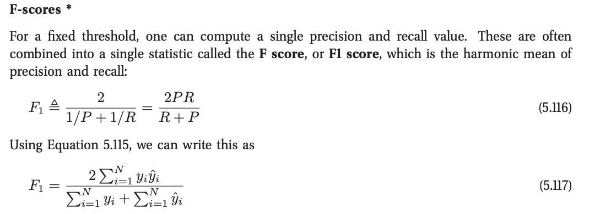

Programming Homework 1[¶](#Programming-Homework-1)
==================================================

Instructions[¶](#Instructions)
------------------------------

-   Do not import other libraries. You are only allowed to use Math, Numpy, Scipy packages which are already imported in the file.
-   Please follow the type annotations. There are some type annotations of the parameters of function calls and return values. Please use Python 3.5 or 3.6 (for full support of typing annotations). You can use Numpy/Scipy inside the function. You have to make the functions’ return values match the required type.
-   In this programming assignment you will implement **k-Nearest Neighbours and Decision Tree**. We provide the bootstrap code and you are expected to complete the **classes** and **functions**.
-   Download all files of PA1 from Vocareum and save in the same folder.
-   Only modifications in files {`knn.py`, `utils.py`} will be accepted and graded. All other modifications will be ignored. Submit those three files on Vocareum once you have finished. Which means you need to delete unnecessary files before you submit your work on Vocareum.

--------------------------------

Problem 1: K-nearest neighbor (KNN) for binary classification (50 points)[¶](#Problem-1:-K-nearest-neighbor-(KNN)-for-binary-classification-(50-points))
--------------------------------------------------------------------------------------------------------------------------------------------------------

#### Some notes[¶](#Some-notes)

In this task, we will use four distance functions: (we removed the vector symbol for simplicity)

-   Euclidean distance: \$\$d(x, y) = \\sqrt{\\langle x - y, x - y \\rangle}\$\$
-   Minkowski distance: \$\$ d(x, y) = \\bigg(\\sum\_{i=1}\^{n}\\big|x\_{i} - y\_{i}\\big|\^{3}\\bigg)\^{1/3}\$\$
-   Inner product distance: \$\$d(x, y ) = \\langle x, y \\rangle\$\$
-   Gaussian kernel distance: \$\$d(x, y ) = \\exp({−\\frac 12 \\langle x - y, x - y \\rangle}) \$\$
-   Cosine Similarity: \$\$d(x, y) =\\cos(\\theta )={\\mathbf {x} \\cdot \\mathbf {y} \\over \\|\\mathbf {x} \\|\\|\\mathbf {y} \\|}\$\$

**Cosine Distance** = 1 - Cosine Similarity

**F1-score** is a important metric for binary classification, as sometimes the accuracy metric has the false positive (a good example is in MLAPP book 2.2.3.1 “Example: medical diagnosis”, Page 29). We have provided a basic definition. For more you can read 5.7.2.3 from MLAPP book.

### Part 1.1 F1 score and Distance Functions[¶](#Part-1.1-F1-score-and-Distance-Functions)

Implement the following items in *util.py*

    - f1_score
    - class Distance
        - euclidean_distance
        - minkowski_distance
        - inner_product_distance
        - gaussian_kernel_distance
        - cosine distanceand the functions

Simply follow the notes above and to finish all these functions. You are not allowed to call any packages which are already not imported. Please note that all these methods are graded individually so you can take advantage of the grading script to get partial marks for these methods instead of submitting the complete code in one shot.

In [5]:

    def f1_score(real_labels, predicted_labels):
        """
        Information on F1 score - https://en.wikipedia.org/wiki/F1_score
        :param real_labels: List[int]
        :param predicted_labels: List[int]
        :return: float
        """
    
    class Distances:
        @staticmethod
        def minkowski_distance(point1, point2):
            """
            Minkowski distance is the generalized version of Euclidean Distance
            It is also know as L-p norm (where p>=1) that you have studied in class
            For our assignment we need to take p=3
            Information on Minkowski distance - https://en.wikipedia.org/wiki/Minkowski_distance
            :param point1: List[float]
            :param point2: List[float]
            :param p: int
            :return: float
            """
    
        @staticmethod
        def euclidean_distance(point1, point2):
            """
            :param point1: List[float]
            :param point2: List[float]
            :return: float
            """
    
        @staticmethod
        def inner_product_distance(point1, point2):
            """
            :param point1: List[float]
            :param point2: List[float]
            :return: float
            """
    
        @staticmethod
        def cosine_similarity_distance(point1, point2):
            """
           :param point1: List[float]
           :param point2: List[float]
           :return: float
           """
    
        @staticmethod
        def gaussian_kernel_distance(point1, point2):
            """
           :param point1: List[float]
           :param point2: List[float]
           :return: float
           """

### Part 1.2 KNN class[¶](#Part-1.2-KNN-class)

Implement the following items in *knn.py*

    - class KNN
        - train
        - get_k_neighbors
        - predict

In [6]:

    class KNN:
        
        def train(self, features, labels):
            """
            In this function, features is simply training data which is a 2D list with float values.
            For example, if the data looks like the following: Student 1 with features age 25, grade 3.8 and labeled as 0,
            Student 2 with features age 22, grade 3.0 and labeled as 1, then the feature data would be
            [ [25.0, 3.8], [22.0,3.0] ] and the corresponding label would be [0,1]
    
            For KNN, the training process is just loading of training data. Thus, all you need to do in this function
            is create some local variable in KNN class to store this data so you can use the data in later process.
            :param features: List[List[float]]
            :param labels: List[int]
            """
    
        def get_k_neighbors(self, point):
            """
            This function takes one single data point and finds k-nearest neighbours in the training set.
            You already have your k value, distance function and you just stored all training data in KNN class with the
            train function. This function needs to return a list of labels of all k neighours.
            :param point: List[float]
            :return:  List[int]
            """
    
        def predict(self, features):
            """
            This function takes 2D list of test data points, similar to those from train function. Here, you need process
            every test data point, reuse the get_k_neighbours function to find the nearest k neighbours for each test
            data point, find the majority of labels for these neighbours as the predict label for that testing data point.
            Thus, you will get N predicted label for N test data point.
            This function need to return a list of predicted labels for all test data points.
            :param features: List[List[float]]
            :return: List[int]
            """

### Part 1.3 Hyperparameter Tuning[¶](#Part-1.3-Hyperparameter-Tuning)

Implement the following items in *knn.py*

    - class KNN
        - train
        - get_k_neighbors
        - predict

In [12]:

    class HyperparameterTuner:
        def __init__(self):
            self.best_k = None
            self.best_distance_function = None
            self.best_scaler = None
    
        def tuning_without_scaling(self, distance_funcs, x_train, y_train, x_val, y_val):
            """
            :param distance_funcs: dictionary of distance functions you must use to calculate the distance.
                Make sure you loop over all distance functions for each data point and each k value.
                You can refer to test.py file to see the format in which these functions will be
                passed by the grading script
            :param x_train: List[List[int]] training data set to train your KNN model
            :param y_train: List[int] train labels to train your KNN model
            :param x_val:  List[List[int]] Validation data set will be used on your KNN predict function to produce
                predicted labels and tune k and distance function.
            :param y_val: List[int] validation labels
    
            Find(tune) best k, distance_function and model (an instance of KNN) and assign to self.best_k,
            self.best_distance_function and self.best_model respectively.
            NOTE: self.best_scaler will be None
    
            NOTE: When there is a tie, choose model based on the following priorities:
            Then check distance function  [euclidean > minkowski > gaussian > inner_prod > cosine_dist]
            If they have same distance fuction, choose model which has a less k.
            """

### Part 1.4 Data Transformation[¶](#Part-1.4-Data-Transformation)

We are going to add one more step (data transformation) in the data processing part and see how it works. Sometimes, normalization plays an important role to make a machine learning model work. This link might be helpful [https://en.wikipedia.org/wiki/Feature\_scaling](https://en.wikipedia.org/wiki/Feature_scaling)

Here, we take two different data transformation approaches.

#### Normalizing the feature vector[¶](#Normalizing-the-feature-vector)

This one is simple but some times may work well. Given a feature vector x, the normalized feature vector is given by

\$\$ x' = \\frac{x}{\\sqrt{\\langle x, x \\rangle}} \$\$ If a vector is a all-zero vector, we let the normalized vector also be a all-zero vector.

#### Min-max scaling the feature matrix[¶](#Min-max-scaling-the-feature-matrix)

The above normalization is data independent, that is to say, the output of the normalization function doesn’t depend on rest of the training data. However, sometimes it is helpful to do data dependent normalization. One thing to note is that, when doing data dependent normalization, we can only use training data, as the test data is assumed to be unknown during training (at least for most classification tasks).

The min-max scaling works as follows: after min-max scaling, all values of training data’s feature vectors are in the given range. Note that this doesn’t mean the values of the validation/test data’s features are all in that range, because the validation/test data may have different distribution as the training data.

Implement the functions in the classes NormalizationScaler and MinMaxScaler in utils.py

1.normalize

normalize the feature vector for each sample . For example, if the input features = [[3, 4], [1, -1], [0, 0]], the output should be [[0.6, 0.8], [0.707107, -0.707107], [0, 0]]

2.min\_max\_scale

normalize the feature vector for each sample . For example, if the input features = [[2, -1], [-1, 5], [0, 0]], the output should be [[1, 0], [0, 1], [0.333333, 0.16667]]

In [9]:

    class NormalizationScaler:
        def __init__(self):
            pass
    
        def __call__(self, features):
            """
            Normalize features for every sample
    
            Example
            features = [[3, 4], [1, -1], [0, 0]]
            return [[0.6, 0.8], [0.707107, -0.707107], [0, 0]]
    
            :param features: List[List[float]]
            :return: List[List[float]]
            """
    
    class MinMaxScaler:
        """
        Please follow this link to know more about min max scaling
        https://en.wikipedia.org/wiki/Feature_scaling
        You should keep some states inside the object.
        You can assume that the parameter of the first __call__
        will be the training set.
    
        Hint: Use a variable to check for first __call__ and only compute
                and store min/max in that case.
    
        Note: You may assume the parameters are valid when __call__
                is being called the first time (you can find min and max).
    
        Example:
            train_features = [[0, 10], [2, 0]]
            test_features = [[20, 1]]
    
            scaler1 = MinMaxScale()
            train_features_scaled = scaler1(train_features)
            # train_features_scaled should be equal to [[0, 1], [1, 0]]
    
            test_features_scaled = scaler1(test_features)
            # test_features_scaled should be equal to [[10, 0.1]]
    
            new_scaler = MinMaxScale() # creating a new scaler
            _ = new_scaler([[1, 1], [0, 0]]) # new trainfeatures
            test_features_scaled = new_scaler(test_features)
            # now test_features_scaled should be [[20, 1]]
    
        """
    
        def __init__(self):
            pass
    
        def __call__(self, features):
            """
            normalize the feature vector for each sample . For example,
            if the input features = [[2, -1], [-1, 5], [0, 0]],
            the output should be [[1, 0], [0, 1], [0.333333, 0.16667]]
    
            :param features: List[List[float]]
            :return: List[List[float]]
            """

#### Hyperparameter Tuning[¶](#Hyperparameter-Tuning)

This part is similar to Part 1.3 except that before passing your trainig and validation data to KNN model to tune k and distance function, you need to create the normalized data using these two scalers to transform your data, both training and validation. Again, we will use f1-score to compare different models. Here we have 3 hyperparameters i.e. k, distance\_function and scaler.

In [11]:

    class HyperparameterTuner:
        def __init__(self):
            self.best_k = None
            self.best_distance_function = None
            self.best_scaler = None
        def tuning_with_scaling(self, distance_funcs, scaling_classes, x_train, y_train, x_val, y_val):
            """
             :param distance_funcs: dictionary of distance funtions you use to calculate the distance. Make sure you
                loop over all distance function for each data point and each k value.
                You can refer to test.py file to see the format in which these functions will be
                passed by the grading script
            :param scaling_classes: dictionary of scalers you will use to normalized your data.
            Refer to test.py file to check the format.
            :param x_train: List[List[int]] training data set to train your KNN model
            :param y_train: List[int] train labels to train your KNN model
            :param x_val: List[List[int]] validation data set you will use on your KNN predict function to produce predicted
                labels and tune your k, distance function and scaler.
            :param y_val: List[int] validation labels
    
            Find(tune) best k, distance_funtion, scaler and model (an instance of KNN) and assign to self.best_k,
            self.best_distance_function, self.best_scaler and self.best_model respectively
    
            NOTE: When there is a tie, choose model based on the following priorities:
            For normalization, [min_max_scale > normalize];
            Then check distance function  [euclidean > minkowski > gaussian > inner_prod > cosine_dist]
            If they have same distance function, choose model which has a less k.
            """

### Use of test.py file[¶](#Use-of-test.py-file)

Please make use of test.py file to debug your code and make sure your code is running properly. After you have completed all the classes and functions mentioned above, test.py file will run smoothly and will show a similar output as follows (This is a sample output. your actual output values might vary):

x\_train shape = (242, 14) y\_train shape = (242,)

#### Without Scaling[¶](#Without-Scaling)

k = 1 distance function = euclidean

#### With Scaling[¶](#With-Scaling)

k = 23 distance function = cosine\_dist scaler = min\_max\_scale

### Grading Guideline for KNN (50 points)[¶](#Grading-Guideline-for-KNN-(50-points))

-   F-1 score and Distance functions: 15 points

-   MinMaxScaler and NormalizationScaler (10 points- 5 each)

-   Finding best parameters before scaling - 10 points

-   Finding best parameters after scaling - 10 points

-   Doing classification of the data - 5 points

