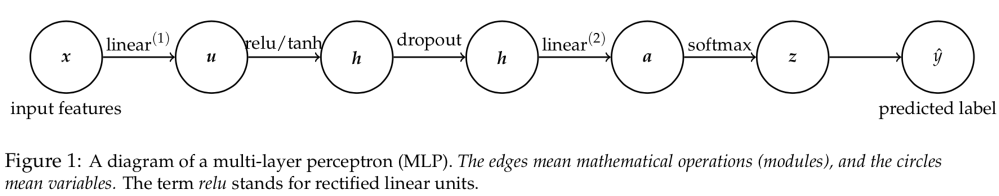

Homework \#3 Programming Assignment[¶](#Homework-#3-Programming-Assignment)
===========================================================================

CSCI567, Fall 2019
Victor Adamchik
**Due: 11:59 pm, November 3rd 2019**

### Instructions:[¶](#Instructions:)

1.  Deadline for the assignment is November 3rd 2019 at 23:59:59 PDT.
2.  Do not import other libraries. You are only allowed to use Math, Numpy packages which are already imported in the file. DO NOT use scipy functions.
3.  Please use Python 3.5 or 3.6 (for full support of typing annotations). You have to make the functions’ return values match the required type.
4.  In this programming assignment you will implement Neural Networks. We have provided the bootstrap code and you are expected to complete the classes and functions.
5.  Download all files of PA3 from Vocareum and save in the same folder.
6.  Only modifications in files {neural\_networks.py} will be accepted and graded. Submit {neural\_networks.py} on Vocareum once you are finished. Please delete unnecessary files before you submit your work on Vocareum.
7.  DO NOT CHANGE THE OUTPUT FORMAT. DO NOT MODIFY THE CODE UNLESS WE INSTRUCT YOU TO DO SO. A homework solution that mismatches the provided setup, such as format, name initializations, etc., will not be graded. It is your responsibility to make sure that your code runs well on Vocareum.

On Vocareum, when you submit your homework, it takes around 5-6 minutes to run the grading scripts and evaluate your code. So, please be patient regarding the same.

Neural Networks (40 points)
 [¶](#Neural-Networks-(40-points))
------------------------------------------------------

For this assignment, you are asked to implement neural networks. You will use this neural network to classify MNIST database of handwritten digits (0-9). The architecture of the neural network you will implement is based on the multi-layer perceptron (MLP, just another term for fully connected feedforward networks we discussed in the lecture), which is shown as following. It is designed for a K-class classification problem.

Let \$(x\\in\\mathbb{R}\^D, y\\in\\{1,2,\\cdots,K\\})\$ be a labeled instance, such an MLP performs the following computations:
 \$\$ \\begin{align} \\textbf{input features}: \\hspace{15pt} & x \\in \\mathbb{R}\^D \\\\ \\textbf{linear}\^{(1)}: \\hspace{15pt} & u = W\^{(1)}x + b\^{(1)} \\hspace{2em}, W\^{(1)} \\in \\mathbb{R}\^{M\\times D} \\text{ and } b\^{(1)} \\in \\mathbb{R}\^{M} \\label{linear\_forward}\\\\ \\textbf{tanh}:\\hspace{15pt} & h =\\cfrac{2}{1+e\^{-2u}}-1 \\label{tanh\_forward}\\\\ \\textbf{relu}: \\hspace{15pt} & h = max\\{0, u\\} = \\begin{bmatrix} \\max\\{0, u\_1\\}\\\\ \\vdots \\\\ \\max\\{0, u\_M\\}\\\\ \\end{bmatrix} \\label{relu\_forward}\\\\ \\textbf{linear}\^{(2)}: \\hspace{15pt} & a = W\^{(2)}h + b\^{(2)} \\hspace{2em}, W\^{(2)} \\in \\mathbb{R}\^{K\\times M} \\text{ and } b\^{(2)} \\in \\mathbb{R}\^{K} \\label{linear2\_forward}\\\\ \\textbf{softmax}: \\hspace{15pt} & z = \\begin{bmatrix} \\cfrac{e\^{a\_1}}{\\sum\_{k} e\^{a\_{k}}}\\\\ \\vdots \\\\ \\cfrac{e\^{a\_K}}{\\sum\_{k} e\^{a\_{k}}} \\\\ \\end{bmatrix}\\\\ \\textbf{predicted label}: \\hspace{15pt} & \\hat{y} = \\mathrm{argmax}\_k z\_k. %& l = -\\sum\_{k} y\_{k}\\log{\\hat{y\_{k}}} \\hspace{2em}, \\vy \\in \\mathbb{R}\^{k} \\text{ and } y\_k=1 \\text{ if } \\vx \\text{ belongs to the } k' \\text{-th class}. \\end{align} \$\$

For a \$K\$-class classification problem, one popular loss function for training (i.e., to learn \$W\^{(1)}\$, \$W\^{(2)}\$, \$b\^{(1)}\$, \$b\^{(2)}\$) is the cross-entropy loss. Specifically we denote the cross-entropy loss with respect to the training example \$(x, y)\$ by \$l\$:
 \$\$ \\begin{align} l = -\\log (z\_y) = \\log \\left( 1 + \\sum\_{k\\neq y} e\^{a\_k - a\_y} \\right) \\end{align} \$\$
 Note that one should look at \$l\$ as a function of the parameters of the network, that is, \$W\^{(1)}, b\^{(1)}, W\^{(2)}\$ and \$b\^{(2)}\$. For ease of notation, let us define the one-hot (i.e., 1-of-\$K\$) encoding of a class \$y\$ as

\\begin{align} y \\in \\mathbb{R}\^K \\text{ and } y\_k = \\begin{cases} 1, \\text{ if }y = k,\\\\ 0, \\text{ otherwise}. \\end{cases} \\end{align} so that \\begin{align} l = -\\sum\_{k} y\_{k}\\log{z\_k} = -y\^T \\begin{bmatrix} \\log z\_1\\\\ \\vdots \\\\ \\log z\_K\\\\ \\end{bmatrix} = -y\^T\\log{z}. \\end{align}

We can then perform error-backpropagation, a way to compute partial derivatives (or gradients) w.r.t the parameters of a neural network, and use gradient-based optimization to learn the parameters.

#### Submission: You need to submit both neural\_networks.py and utils.py.[¶](#Submission:-You-need-to-submit-both-neural_networks.py-and-utils.py.)

### Q1. Mini batch Stochastic Gradient Descent[¶](#Q1.-Mini-batch-Stochastic-Gradient-Descent)

First, you need to implement mini-batch stochastic gradient descent which is a gradient-based optimization to learn the parameters of the neural network.
 You need to realize two alternatives for SGD, one without momentum and one with momentum. We will pass a variable \$\\alpha\$ to indicate which option. When \$\\alpha \\leq 0\$, the parameters are updated just by gradient. When \$\\alpha \> 0\$, the parameters are updated with momentum and \$\\alpha\$ will also represents the discount factor as following:
 \$\$ \\begin{align} \\upsilon = \\alpha \\upsilon - \\eta \\delta\_t\\\\ w\_t = w\_{t-1} + \\upsilon \\end{align} \$\$
 You can use the formula above to update the weights.
 Here, \$\\alpha\$ is the discount factor such that \$\\alpha \\in (0, 1)\$. It is given by us and you do not need to adjust it.
 \$\\eta\$ is the learning rate. It is also given by us.
 \$\\upsilon\$ is the velocity update (A.K.A momentum update). \$\\delta\_t\$ is the gradient

-   `TODO 1` You need to complete `def miniBatchStochasticGradientDescent(model, momentum, _lambda, _alpha, _learning_rate)` in `neural_networks.py`

 Notice that for a complete mini-batch SGD, you will also need to find the best size of mini-batch and number of epochs. In this assignment, we omit this step. Both size of mini-batch and number of epoch has already been given. You do not need to adjust them.

### Q2. Linear Layer (15 points)[¶](#Q2.-Linear-Layer-(15-points))

Second, you need to implement the linear layer of MLP. In this part, you need to implement 3 python functions in `class linear_layer`.

In the function `def __init__(self, input_D, output_D)`, you need to initialize W with random values using np.random.normal such that the mean is 0 and standard deviation is 0.1. You also need to initialize gradients to zeroes in the same function.

\$\$ \\begin{align} \\text{forward pass:}\\hspace{2em} & u = \\text{linear}\^{(1)}\\text{.forward}(x) = W\^{(1)}x + b\^{(1)},\\\\ &\\text{where } W\^{(1)} \\text{ and } b\^{(1)} \\text{ are its parameters.}\\nonumber\\\\ \\nonumber\\\\ \\text{backward pass:}\\hspace{2em} &[\\frac{\\partial l}{\\partial x}, \\frac{\\partial l}{\\partial W\^{(1)}}, \\frac{\\partial l}{\\partial b\^{(1)}}] = \\text{linear}\^{(1)}\\text{.backward}(x, \\frac{\\partial l}{\\partial u}). \\end{align} \$\$

You can use the above formula as a reference to implement the `def forward(self, X)` forward pass and `def backward(self, X, grad)` backward pass in class linear\_layer. In backward pass, you only need to return the backward\_output. You also need to compute gradients of W and b in backward pass.

-   `TODO 2` You need to complete `def __init__(self, input_D, output_D)` in `class linear_layer` of `neural_networks.py`
-   `TODO 3` You need to complete `def forward(self, X)` in `class linear_layer` of `neural_networks.py`
-   `TODO 4` You need to complete `def backward(self, X, grad)` in `class linear_layer` of `neural_networks.py`

### Q3. Activation function - tanh (15 points)[¶](#Q3.-Activation-function---tanh-(15-points))

Now, you need to implement the activation function tanh. In this part, you need to implement 2 python functions in `class tanh`. In `def forward(self, X)`, you need to implement the forward pass and you need to compute the derivative and accordingly implement `def backward(self, X, grad)`, i.e. the backward pass. \$\$ \\begin{align} \\textbf{tanh}:\\hspace{15pt} & h =\\cfrac{2}{1+e\^{-2u}}-1\\\\ \\end{align} \$\$ You can use the above formula for tanh as a reference.

-   `TODO 5` You need to complete `def forward(self, X)` in `class tanh` of `neural_networks.py`
-   `TODO 6` You need to complete `def backward(self, X, grad)` in `class tanh` of `neural_networks.py`

### Q4. Activation function - relu (15 points)[¶](#Q4.-Activation-function---relu-(15-points))

You need to implement another activation function called relu. In this part, you need to implement 2 python functions in `class relu`. In `def forward(self, X)`, you need to implement the forward pass and you need to compute the derivative and accordingly implement `def backward(self, X, grad)`, i.e. the backward pass. \$\$ \\begin{align} \\textbf{relu}: \\hspace{15pt} & h = max\\{0, u\\} = \\begin{bmatrix} \\max\\{0, u\_1\\}\\\\ \\vdots \\\\ \\max\\{0, u\_M\\}\\\\ \\end{bmatrix} \\end{align} \$\$ You can use the above formula for relu as a reference.

-   `TODO 7` You need to complete `def forward(self, X)` in `class relu` of `neural_networks.py`
-   `TODO 8` You need to complete `def backward(self, X, grad)` in `class relu` of `neural_networks.py`

### Q5. Dropout (15 points)[¶](#Q5.-Dropout-(15-points))

To prevent overfitting, we usually add regularization. Dropout is another way of handling overfitting. In this part, you will initially read and understand `def forward(self, X, is_train)` i.e. the forward pass of `class dropout`. You will also derive partial derivatives accordingly to implement `def backward(self, X, grad)` i.e. the backward pass of `class dropout`.
 Now we take an intermediate variable \$q \\in \\mathbb{R}\^J\$ which is the output from one of the layers. Then we define the forward and the backward passes in dropout as follows.
 The forward pass obtains the output after dropout. \\begin{align} \\text{forward pass:}\\hspace{2em} & {s} = \\text{dropout}\\text{.forward}({q}\\in\\mathbb{R}\^J) = \\frac{1}{1-r}\\times \\begin{bmatrix} \\textbf{1}[p\_1 \>= r] \\times q\_1\\\\ \\vdots \\\\ \\textbf{1}[p\_J \>= r] \\times q\_J\\\\ \\end{bmatrix}, \\\\ \\nonumber\\\\ &\\text{where } p\_j \\text{ is generated randomly from }[0, 1), \\forall j\\in\\{1,\\cdots,J\\}, \\nonumber\\\\ &\\text{and } r\\in [0, 1) \\text{ is a pre-defined scalar named dropout rate which is given to you}. \\end{align}
 The backward pass computes the partial derivative of loss with respect to \$q\$ from the one with respect to the forward pass result, which is \$\\frac{\\partial l}{\\partial s}\$.
 \\begin{align} \\text{backward pass:}\\hspace{2em} &\\frac{\\partial l}{\\partial {q}} = \\text{dropout}\\text{.backward}({q}, \\frac{\\partial l}{\\partial {s}})= \\frac{1}{1-r}\\times \\begin{bmatrix} \\textbf{1}[p\_1 \>= r] \\times \\cfrac{\\partial l}{\\partial s\_1}\\\\ \\vdots \\\\ \\textbf{1}[p\_J \>= r] \\times \\cfrac{\\partial l}{\\partial s\_J}\\\\ \\end{bmatrix}. \\end{align}

Note that \$p\_j, j\\in\\{1,\\cdots,J\\}\$ and \$r\$ are not be learned so we do not need to compute the derivatives w.r.t. to them. You do not need to find the best \$r\$ since we have picked it for you. Moreover, \$p\_j, j\\in\\{1,\\cdots,J\\}\$ are re-sampled every forward pass, and are kept for the corresponding backward pass.

-   `TODO 9` You need to complete `def backward(self, X, grad)` in `class dropout` of `neural_networks.py`

### Q6. Connecting the dots[¶](#Q6.-Connecting-the-dots)

In this part, you will combine the modules written from question Q1 to Q5 by implementing TODO snippets in the `def main(main_params, optimization_type="minibatch_sgd")` i.e. main function. After implementing forward and backward passes of MLP layers in Q1 to Q5,now in the main function you will call the forward methods and backward methods of every layer in the model in an appropriate order based on the architecture.

-   `TODO 10` You need to complete `main(main_params, optimization_type="minibatch_sgd")` in `neural_networks.py`

### Grading[¶](#Grading)

Your code will be graded on Vocareum with autograding script. For your reference, the solution code takes around 5 minutes to execute. As long as your code can finish grading on Vocareum, you should be good. When you finish all `TODO` parts, please click submit button on Vocareum. Sometimes you may need to come back to check grading report later.

Your code will be tested on the correctness of modules you have implemented as well as certain custom testcases. 60 points are assigned for question Q1 to Q5 while 40 points are assigned to custom testcases.

#### Grading Guideline for Neural Networks (100 points)[¶](#Grading-Guideline-for-Neural-Networks-(100-points))

##### Functions[¶](#Functions)

1.  Linear Layer: 15 points

2.  Activation Function-tanh: 15 points

3.  Activation Function-relu: 15 points

4.  Dropout:15 points

##### Test-Cases[¶](#Test-Cases)

Custom testcases: 40 points

### Google Colab[¶](#Google-Colab)

Google colab is a free online jupyter notebook made available by google for researchers/students wherein the jupyter notebook is backed by GPU.

Jupyter notebook is a python notebook with executable cells accompanied by textual texts for better documentation of the code. They are a good way to document the code.

GPUs are now standard way to compute weights and gradients during training of neural networks, they are faster than CPUs due to their inherent parallelization nature.

We highly suggest trying it for computation of your forward networks and tinkering around with the num\_epochs, learning rate to see how the training loss varies. You can look at it here:

[https://colab.research.google.com/](https://colab.research.google.com/)

#### Note[¶](#Note)

Do NOT change the hyperparameters and submit on vocareum even if your changes give better training loss. Changing the hyperparemeters is just for your understanding of how gradient descent is working to optimize the code.
