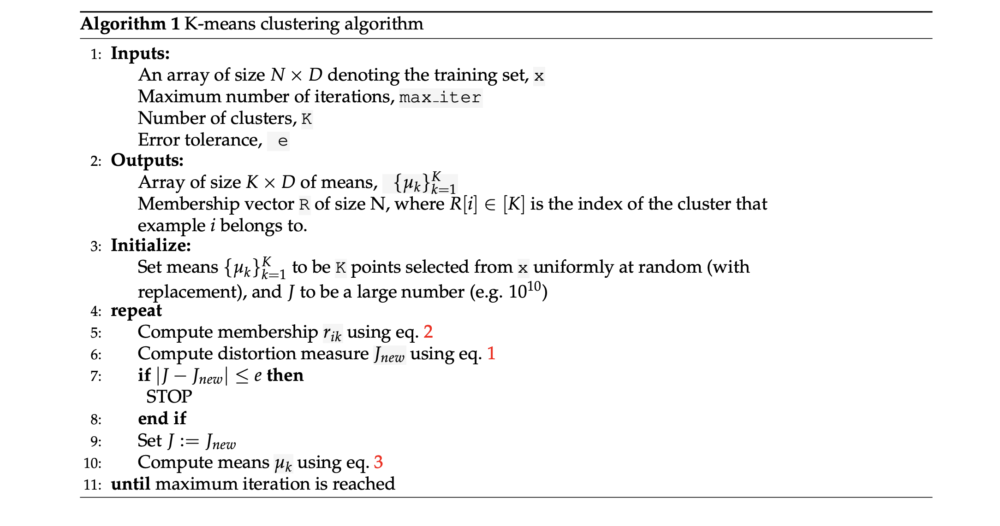

General instructions
====================

High Level Description
----------------------

In this assignment you are asked to implement K-means clustering to identify main clusters in
 the data, use the discovered centroid of cluster for classification. Specifically, you will

-   Implement K-means clustering algorithm to identify clusters in a two-dimensional toy-dataset.
-   Implement image compression using K-means clustering algorithm.
-   Implement classification using the centroids identified by clustering on digits dataset.
-   Implement K-means++ clustering algorithm to identify clusters in a two-dimensional toy-dataset i.e. implement the kmeans++ function to compute the centers.

NOTE: You only need to make changes in [Kmeans.py](http://Kmeans.py) and use [KmeansTest.py](http://KmeansTest.py) for testing purposes and to see your results. You can find all TODO’s sequentially in the [Kmeans.py](http://Kmeans.py) file.
 Depending on your environment you may need to install the python library named, ”pillow”, which is used by matplotlib to process some of the images needed for this assignment.
 You can install it by running ’pip3 install pillow’ in your command line.

### Grading Guidelines (50 points):

You are only required to submit [Kmeans.py](http://Kmeans.py) as that is the only file where you will be making any changes.

-   get\_k\_means\_plus\_plus\_center\_indices - 5 points (5 \*1)
-   transform\_image - 10 points (5 \* 2 test cases) We are checking the MSE and the number of iterations for this
-   Kmeans( ) class on Toy dataset - 15 points (3 \* 5 test cases) We are checking the centroid and membership for Kmeans and Kmeans++
-   KmeansClassifier( ) class - 20 points (5 \* 4 test cases) We are checking the accuracy and the centroids of the assignments.

### Dataset for K-Means Clustering

We will use 2 datasets - 2-D Toy Dataset and Digits datasets for K means part.
 Toy Dataset is a two-dimensional dataset generated from 4 Gaussian distributions. We will use this
 dataset to visualize the results of our algorithm in two dimensions. You can find it in data\_loader.py
 We will use digits dataset from sklearn to test K-means based classifier and generate digits using
 Gaussian Mixture model. Each data point is a 8 × 8 image of a digit. This is similar to MNIST but less
 complex. There are 10 classes in digits dataset.
 Link for Digits dataset: sklearn.datasets.digits [http://scikit-learn.org/stable/modules/generated/sklearn.datasets.load\_digits.html\#sklearn.datasets.load\_digits](http://scikit-learn.org/stable/modules/generated/sklearn.datasets.load_digits.html#sklearn.datasets.load_digits)

1. K Means Clustering
---------------------

Recall that for a dataset x1,...,xN∈RDx\_1, . . . , x\_N ∈ R\^Dx1​,...,xN​∈RD, the K-means distortion objective is:
 F({μk},{rnk})=∑i=1N∑k=1Krnk∥μk−xn∥22(1) F(\\{\\mu\_k\\}, \\{r\_{nk}\\}) = \\sum\_{i=1}\^N \\sum\_{k=1}\^K r\_{nk} \\|\\mu\_k- x\_n\\|\_2\^2 \\qquad (1) F({μk​},{rnk​})=i=1∑N​k=1∑K​rnk​∥μk​−xn​∥22​(1)

where µ1,...,µKµ\_1, . . . , µ\_Kµ1​,...,µK​ are centroids of the K clusters and rik∈0,1r\_{ik} ∈ {0, 1}rik​∈0,1 represents whether example i belongs to cluster k.
 

### 1.1 Implementing k-means++ algorithm

Recall from lecture Kmeans++. Please refer to the algorithm below. In simple terms, cluster centers are initially chosen at random from the set of input observation vectors, where the probability of choosing vector x is high if x is not near any previously chosen centers.

Here is a one-dimensional example. Our observations are [0,1,2,3,4][0, 1, 2, 3, 4][0,1,2,3,4]. Let the first center, c1c1c1, be 0. The probability that the next cluster center, c2c2c2, is x is proportional to ∣∣c1−x∣∣2||c1-x||\^2∣∣c1−x∣∣2. So, P(c2=1)=1a,P(c2=2)=4a,P(c2=3)=9a,P(c2=4)=16aP(c2 = 1) = 1a, P(c2 = 2) = 4a, P(c2 = 3) = 9a, P(c2 = 4) = 16aP(c2=1)=1a,P(c2=2)=4a,P(c2=3)=9a,P(c2=4)=16a, where a=1/(1+4+9+16)a = 1/(1+4+9+16)a=1/(1+4+9+16).
 Suppose c2=4c2 = 4c2=4. Then, P(c3=1)=1a,P(c3=2)=4a,P(c3=3)=1aP(c3 = 1) = 1a, P(c3 = 2) = 4a, P(c3 = 3) = 1aP(c3=1)=1a,P(c3=2)=4a,P(c3=3)=1a, where a=1/(1+4+1)a = 1/(1+4+1)a=1/(1+4+1).
 For more insights, follow this: [http://ilpubs.stanford.edu:8090/778/1/2006-13.pdf](http://ilpubs.stanford.edu:8090/778/1/2006-13.pdf)
 

Implement Algorithm by filling out the TODO parts in function **get\_k\_means\_plus\_plus\_center\_indices** of file **[kmeans.py](http://kmeans.py)**. You can test this function on Vocareum separately.

    def get_k_means_plus_plus_center_indices(n, n_cluster, x, generator=np.random):
        :param n: number of samples in the data
        :param n_cluster: the number of cluster centers required
        :param x: data - numpy array of points
        :param generator: random number generator from 0 to n for choosing the first cluster at random
                The default is np.random here but in grading, to calculate deterministic results,
                We will be using our own random number generator.


        :return: the center points array of length n_clusters with each entry being index to a sample
                 which is chosen as centroid.


If the generator is still not clear, its basically a np.random but helps us control the result during testing. SO wherever you would use np.random, use generator instead.

### 1.2 Implementing K-means clustering algorithm

Implement Algorithm 1 by filling out the TODO parts (**fit** function) in class **KMeans** of file **[kmeans.py](http://kmeans.py)**. Note the following:

-   Initialize means by picking self.n\_cluster from N data points
-   Update means and membership until convergence or until you have made self.max\_iter updates.
-   return (means, membership, number\_of\_updates)
-   If at some iteration, there exists a cluster k with no points assigned to it, then do not update the centroid of this cluster for this round.
-   While assigning a sample to a cluster, if there’s a tie (i.e. the sample is equidistant from two centroids), you should choose the one with smaller index (like what numpy.argmin does).
-   For each k, we are trying to compare based on the Euclidean distance.

``` {.language-undefined}
Class KMeans:
       Attr:
           n_cluster - Number of cluster for kmeans clustering (Int)
           max_iter - maximum updates for kmeans clustering (Int)
           e - error tolerance (Float)
           generator - random number generator from 0 to n for choosing the first cluster at random
               The default is np.random here but in grading, to calculate deterministic results,
               We will be using our own random number generator.
           
           def __init__(self, n_cluster, max_iter=100, e=0.0001, generator=np.random):
               self.n_cluster = n_cluster
               self.max_iter = max_iter
               self.e = e
               self.generator = generator
             

           def fit(self, x, centroid_func=get_lloyd_k_means):
               Finds n_cluster in the data x
               params: 
               x - N X D numpy array
               centroid_func - To specify which algorithm we are using to compute the centers(Lloyd(regular) or Kmeans++) The default is Lloyd's Kmeans.
               
               returns: A tuple (centroids a n_cluster X D numpy array, y a length (N,) numpy array where cell i is the ith sample's assigned cluster, number_of_updates a Int)
           Note: Number of iterations is the number of time you update the assignment
```

After you complete the implementation, run [KmeansTest.py](http://KmeansTest.py) to see the results of this on toy
 dataset. You should be able to see three images generated in plots folder. In particular, you can see
 toy dataset predicted labels.png and toy dataset real labels.png and compare the clusters identified by the algorithm against the real clusters. Your implementation should be able to recover the correct clusters sufficiently well. Representative images are shown in fig. 2. Red dots are cluster centroids.
 Note that color coding of recovered clusters may not match that of correct clusters. This is due to mis-match
 in ordering of retrieved clusters and correct clusters (which is fine).


### 1.3 Classification with k-means

Another application of clustering is to obtain a faster version of the nearest neighbor algorithm. Recall that nearest neighbor evaluates the distance of a test sample from every training point to predict its class, which can be very slow. Instead, we can compress the entire training dataset to just the K centroids, where each centroid is now labeled as the majority class of the corresponding cluster. After this compression the prediction time of nearest neighbor is reduced from O(N) to just O(K) (see Algorithm 2 for the pseudocode).
 
 Complete the **fit** and **predict** function in **KMeansClassifier** in file **[kmeans.py](http://kmeans.py)** . Once completed,
 run **[KmeansTest.py](http://KmeansTest.py)** to evaluate the classifier on a test set (digits). For comparison, the script will also print accuracy of a logistic classifier and a nearest neighbor classifier. (Note: a naive K-means classifier may not do well but it can be an effective unsupervised method in a classification pipeline .)

Note: 1) break ties in the same way as in previous problems; 2) if some centroid doesn’t contain any
 point, set the label of this centroid as 0.

The prediction accuracy baseline is 0.77 for KMeans Lloyd(regular) algorithm and 0.72 for KMeans++ algorithm. Note: these differ on different datasets and in more cases Kmeans++ works better.


        Class KMeansClassifier:
            
            Attr:
                n_cluster - Number of cluster for kmeans clustering (Int)
                max_iter - maximum updates for kmeans clustering (Int)
                e - error tolerance (Float)
                generator - random number generator from 0 to n for choosing the first cluster at random
                The default is np.random here but in grading, to calculate deterministic results,
                We will be using our own random number generator.


            def __init__(self, n_cluster, max_iter=100, e=1e-6, generator=np.random):
                self.n_cluster = n_cluster
                self.max_iter = max_iter
                self.e = e
                self.generator = generator


            def fit(self, x, y, centroid_func=get_lloyd_k_means):
            
                Train the classifier
                params:
                    x - N X D size  numpy array
                    y - (N,) size numpy array of labels
                    centroid_func - To specify which algorithm we are using to compute the centers(Lloyd(regular) or Kmeans++) The default is Lloyd's Kmeans.
                returns:
                    None
                Stores following attributes:
                    self.centroids : centroids obtained by kmeans clustering (n_cluster X D numpy array)
                    self.centroid_labels : labels of each centroid obtained by 
                        majority voting (N,) numpy array) 


​        
             def predict(self, x):
            
                Predict function
                params:
                    x - N X D size  numpy array
                returns:
                    predicted labels - numpy array of size (N,)


​           
​            

### 1.4 Image compression with K-means

In this part, we will look at lossy image compression as an application of clustering. The idea is simply to treat each pixel of an image as a point xix\_ixi​, then perform K-means algorithm to cluster these points, and finally replace each pixel with its centroid.

What you need to implement is to compress an image with K centroids given. Specifically, complete the
 function **transform\_image** in the file **[kmeans.py](http://kmeans.py)**. You have to reduce the image pixels and size by replacing each RGB values with nearest code vectors based on Euclidean distance.
 After your implementation, and after completing Kmeans class, when you run [KmeansTest.py](http://KmeansTest.py), you should be able to see an image compressed\_baboon.png in the plots folder. You can see that this image is distorted as compared to the original baboon.tiff.
 The ideal result should take about 35-40 iterations and the Mean Square Error should be less than 0.0098. It takes about 1-2 minutes to complete normally.

    def transform_image(image, code_vectors):
    
            Quantize image using the code_vectors
    
            Return new image from the image by replacing each RGB value in image with nearest code vectors (nearest in euclidean distance sense)
    
            returns:
                numpy array of shape image.shape
